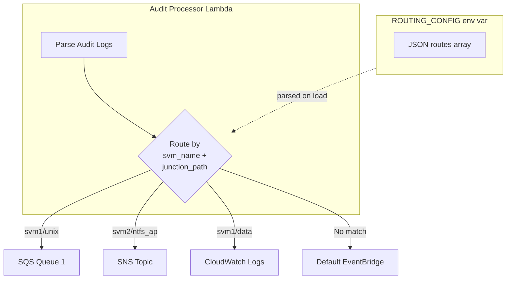

# Detailed Design: Optional Routing Configuration

## Overview

This feature adds optional routing configuration to the FSx ONTAP Audit Event Processing system. Users can define routes that direct events from specific SVM/junction_path combinations to dedicated destinations (SQS, SNS, CloudWatch Logs, or EventBridge), overriding the default EventBridge publishing.

## Detailed Requirements

### Functional Requirements

1. **Config Storage**: Routing config stored as Lambda environment variable (JSON string)
2. **Config Source**: JSON file path passed via CDK context (`-c routing_config=./routes.json`)
3. **Destination Types**: SQS, SNS, CloudWatch Logs, EventBridge
4. **Route Matching**: Exact match on `svm_name` + `junction_path` (both required)
5. **Single Destination**: One destination per route
6. **Default Fallback**: Unmatched events go to default EventBridge bus
7. **Auto-Creation**: CDK creates resources when `destination_arn` not provided
8. **Naming Convention**: Auto-created resources: `{stack_name}-{svm_name}-{junction_path}-{type}`
9. **IAM Permissions**: Broad permissions granted upfront for all destination types
10. **CloudWatch Logs**: Separate log group per route

### Config Format

```json
{
  "routes": [
    {
      "svm_name": "svm1",
      "junction_path": "unix",
      "destination_type": "sqs",
      "destination_arn": "arn:aws:sqs:us-east-1:123456789:existing-queue"
    },
    {
      "svm_name": "svm2",
      "junction_path": "ntfs_ap",
      "destination_type": "sns"
    },
    {
      "svm_name": "svm1",
      "junction_path": "data",
      "destination_type": "cloudwatch_logs"
    },
    {
      "svm_name": "svm3",
      "junction_path": "archive",
      "destination_type": "eventbridge",
      "destination_arn": "arn:aws:events:us-east-1:123456789:event-bus/other-bus"
    }
  ]
}
```

### Route Fields

| Field | Required | Description |
|-------|----------|-------------|
| `svm_name` | Yes | SVM name to match |
| `junction_path` | Yes | Junction path to match |
| `destination_type` | Yes | One of: `sqs`, `sns`, `cloudwatch_logs`, `eventbridge` |
| `destination_arn` | No | Existing resource ARN. If omitted, CDK creates the resource |

## Architecture Overview



## Components and Interfaces

### Lambda Changes

#### New Environment Variable
```
ROUTING_CONFIG = '{"routes": [...]}'
```

#### New Module-Level Code
```python
# Parse routing config on module load
ROUTING_CONFIG = os.environ.get('ROUTING_CONFIG', '')
_routes = {}  # Lookup dict: (svm_name, junction_path) -> config

if ROUTING_CONFIG:
    config = json.loads(ROUTING_CONFIG)
    for route in config.get('routes', []):
        key = (route['svm_name'], route['junction_path'])
        _routes[key] = route
```

#### New AWS Clients
```python
sqs_client = boto3.client('sqs')
sns_client = boto3.client('sns')
logs_client = boto3.client('logs')
```

#### Modified publish_events()
```python
def publish_events(event_list: List[Dict]):
    if not event_list:
        return
    
    # Group events by destination
    routed = {}  # destination_key -> [events]
    default_events = []
    
    for event in event_list:
        key = (event.get('svm_name', ''), event.get('junction_path', ''))
        if key in _routes:
            route = _routes[key]
            dest_key = (route['destination_type'], route.get('destination_arn', ''))
            routed.setdefault(dest_key, []).append(event)
        else:
            default_events.append(event)
    
    # Send to configured destinations
    for (dest_type, dest_arn), events in routed.items():
        _send_to_destination(dest_type, dest_arn, events)
    
    # Send unmatched to default EventBridge
    if default_events and EVENT_BUS_NAME:
        _send_to_eventbridge(EVENT_BUS_NAME, default_events)
```

### CDK Changes

#### New Parameter
```python
def __init__(
    self,
    ...
    routing_config_path: str = None,  # Path to routes.json
    ...
):
```

#### Config Loading in CDK
```python
# Load routing config if provided
routing_config = None
if routing_config_path:
    with open(routing_config_path) as f:
        routing_config = json.load(f)
```

#### Dynamic Resource Creation
```python
route_resources = {}  # Store created resources for IAM

if routing_config:
    for route in routing_config.get('routes', []):
        svm = route['svm_name']
        jp = route['junction_path']
        dest_type = route['destination_type']
        dest_arn = route.get('destination_arn')
        
        if not dest_arn:
            # Create resource
            resource_name = f"{svm}-{jp}".replace('_', '-')
            
            if dest_type == 'sqs':
                q = sqs.Queue(self, f"Route-{resource_name}-Queue", ...)
                route['destination_arn'] = q.queue_url
                route_resources[f"{svm}/{jp}"] = q
                
            elif dest_type == 'sns':
                t = sns.Topic(self, f"Route-{resource_name}-Topic", ...)
                route['destination_arn'] = t.topic_arn
                route_resources[f"{svm}/{jp}"] = t
                
            elif dest_type == 'cloudwatch_logs':
                lg = logs.LogGroup(self, f"Route-{resource_name}-LogGroup", ...)
                route['destination_arn'] = lg.log_group_name
                route_resources[f"{svm}/{jp}"] = lg
```

#### Lambda Environment Update
```python
environment={
    ...
    "ROUTING_CONFIG": json.dumps(routing_config) if routing_config else "",
}
```

#### IAM Permissions
```python
# Grant permissions for all destination types
audit_processor.add_to_role_policy(
    iam.PolicyStatement(
        actions=["sqs:SendMessage", "sqs:SendMessageBatch"],
        resources=["*"],
    )
)
audit_processor.add_to_role_policy(
    iam.PolicyStatement(
        actions=["sns:Publish"],
        resources=["*"],
    )
)
audit_processor.add_to_role_policy(
    iam.PolicyStatement(
        actions=["logs:CreateLogStream", "logs:PutLogEvents"],
        resources=["*"],
    )
)
```

## Data Models

### Route Configuration
```python
@dataclass
class RouteConfig:
    svm_name: str
    junction_path: str
    destination_type: str  # 'sqs' | 'sns' | 'cloudwatch_logs' | 'eventbridge'
    destination_arn: Optional[str] = None
```

### Routing Lookup
```python
# Key: (svm_name, junction_path)
# Value: RouteConfig dict
_routes: Dict[Tuple[str, str], Dict] = {}
```

## Error Handling

| Scenario | Handling |
|----------|----------|
| Invalid JSON in ROUTING_CONFIG | Log error, disable routing, use default EventBridge |
| Missing required fields in route | Skip invalid route, log warning |
| Destination send failure | Log error, continue with other events |
| Route not found | Send to default EventBridge |

## Testing Strategy

### Unit Tests
1. Config parsing with valid/invalid JSON
2. Route matching logic
3. Event grouping by destination
4. Each destination type send function

### Integration Tests
1. End-to-end with routing config
2. Mixed routed and default events
3. Auto-created vs existing resources

## Appendices

### Technology Choices

| Choice | Rationale |
|--------|-----------|
| JSON env var | Simple, no external dependencies, CDK can inject |
| Exact match routing | Simple, predictable, covers use case |
| Broad IAM permissions | Simpler CDK, acceptable for internal tool |

### Alternative Approaches Considered

1. **S3-based config**: More flexible but adds latency and complexity
2. **DynamoDB config**: Overkill for static routing rules
3. **Wildcard matching**: Added complexity, not needed for initial use case
4. **Multiple destinations per route**: Fan-out complexity, EventBridge handles this better
