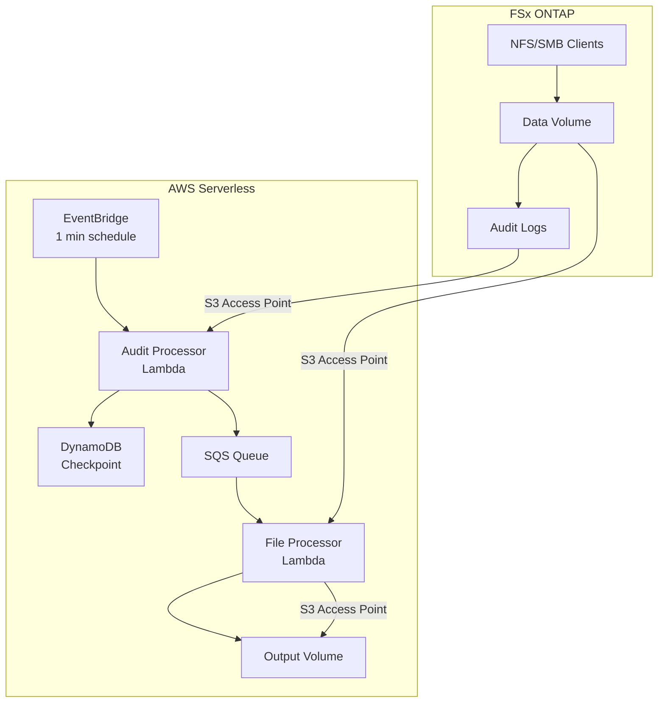
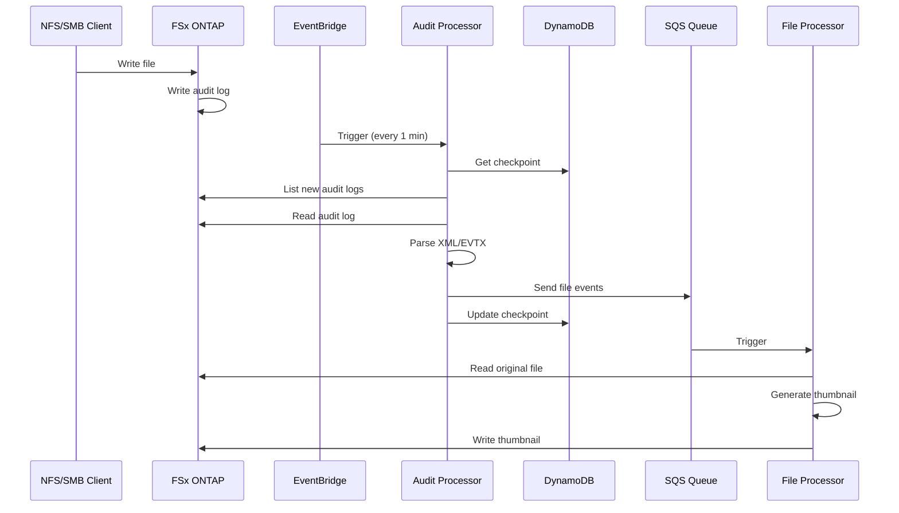

# Architecture

## System Overview

## Data Flow

## Design Patterns

### Checkpoint-based Processing
- Uses DynamoDB to track last processed audit log
- S3 `StartAfter` parameter for efficient listing
- Avoids reprocessing on Lambda restarts

### Active Log Detection
- Skips `*_last.xml` files (currently being written)
- Prevents reading incomplete audit data

### First-Run Initialization
- On first deployment, skips to latest log
- Avoids processing historical backlog

### Separate Input/Output Volumes
- Reads from audited volume
- Writes to separate output volume
- Prevents feedback loop from generated files
