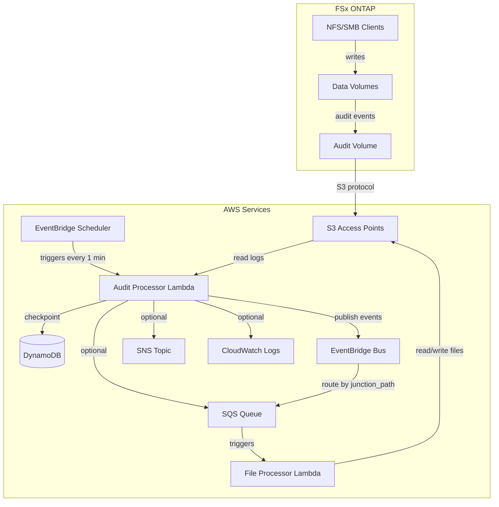
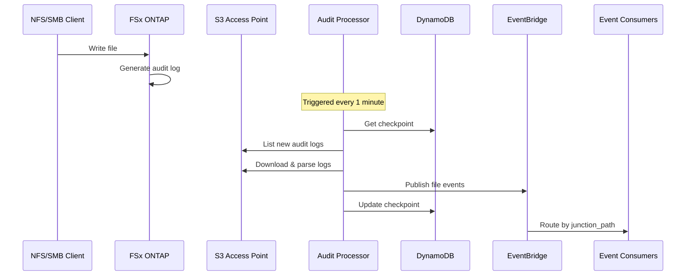

# System Architecture

## High-Level Architecture

## Design Patterns

### Event-Driven Architecture
The system uses polling-based event detection since NFS/SMB writes don't trigger native S3 events. ONTAP audit logs serve as the event source.

### Checkpoint Pattern
DynamoDB stores processing state to ensure:
- At-least-once delivery
- Efficient resumption after failures
- No reprocessing of old logs

### Fan-Out Pattern
EventBridge enables routing events to multiple destinations based on:
- Junction path (volume identifier)
- SVM name
- File type or path patterns

## Data Flow

## Scalability Considerations

1. **Log Processing**: Limited to 10 logs per invocation to prevent timeouts
2. **Event Batching**: SQS/EventBridge batch up to 10 events per API call
3. **Checkpoint Granularity**: Per-log checkpointing for failure recovery
4. **Multi-Volume Support**: Events include junction_path for routing
