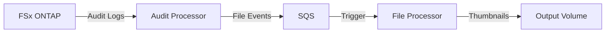

# Documentation Index

> **For AI Assistants**: This file serves as the primary knowledge base index. Start here to understand the codebase structure and find relevant documentation.

## Quick Reference

| Question | Document |
|----------|----------|
| What does this project do? | [codebase_info.md](codebase_info.md) |
| How is it architected? | [architecture.md](architecture.md) |
| What are the main components? | [components.md](components.md) |
| What APIs/interfaces exist? | [interfaces.md](interfaces.md) |
| What data structures are used? | [data_models.md](data_models.md) |
| How do the workflows work? | [workflows.md](workflows.md) |
| What dependencies are needed? | [dependencies.md](dependencies.md) |

---

## Project Summary

**FSx ONTAP Audit Event Processing** is an event-driven serverless application that:
1. Monitors FSx ONTAP audit logs for file creation events
2. Parses XML/EVTX format audit logs
3. Generates thumbnails for image files
4. Writes thumbnails to a separate FSx volume

---

## Directory Structure

```
audits/
├── infra/                    # CDK infrastructure (deploy from here)
│   ├── app.py               # CDK app entry point
│   ├── fsx_audit_stack.py   # Stack definition
│   └── cdk.json             # CDK configuration
├── lambda/                   # Lambda function code
│   ├── audit_processor/     # Parses audit logs → SQS
│   └── file_processor/      # Generates thumbnails
├── layers/                   # Lambda layers
│   ├── evtx/                # python-evtx
│   └── pillow/              # Pillow
├── scripts/                  # Build scripts
│   ├── build_evtx_layer.sh
│   └── build_pillow_layer.sh
├── tests/                    # Unit & integration tests
└── .agents/summary/          # This documentation
```

---

## Key Files

| File | Purpose |
|------|---------|
| `lambda/audit_processor/index.py` | Main audit log processing logic |
| `lambda/file_processor/index.py` | Thumbnail generation logic |
| `infra/fsx_audit_stack.py` | AWS infrastructure definition |
| `infra/app.py` | CDK app entry point |

---

## Common Tasks

### Deploy Infrastructure
```bash
cd infra && cdk deploy \
  -c audit_s3_access_point_alias=<alias> \
  -c file_s3_access_point_alias=<alias> \
  -c output_s3_access_point_alias=<alias>
```

### Run Tests
```bash
source .venv/bin/activate && pytest tests/ -v
```

### Build Lambda Layers
```bash
./scripts/build_evtx_layer.sh
./scripts/build_pillow_layer.sh
```

---

## Architecture Overview



---

## Configuration

### Required S3 Access Points
1. **Audit AP** - Read audit logs
2. **File AP** - Read source files  
3. **Output AP** - Write thumbnails (should be different volume to avoid loop)

### ONTAP Audit Settings
- Format: XML (recommended)
- Rotation: Every 1 minute for low latency
- Guarantee: true (synchronous logging)
