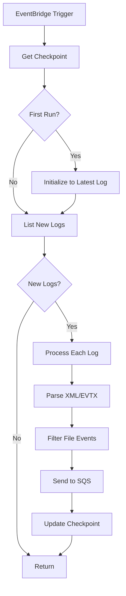
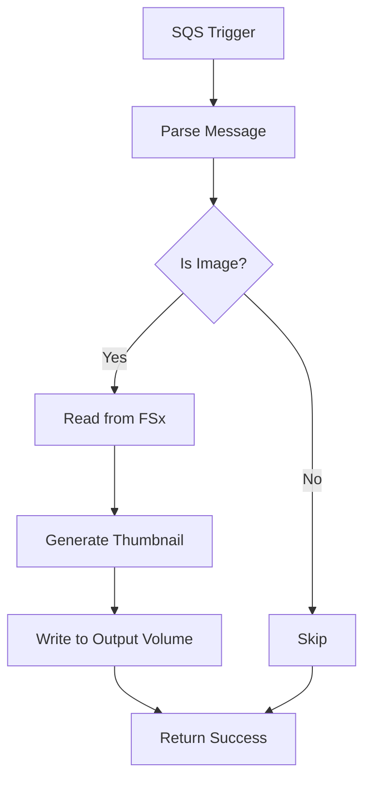
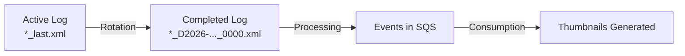
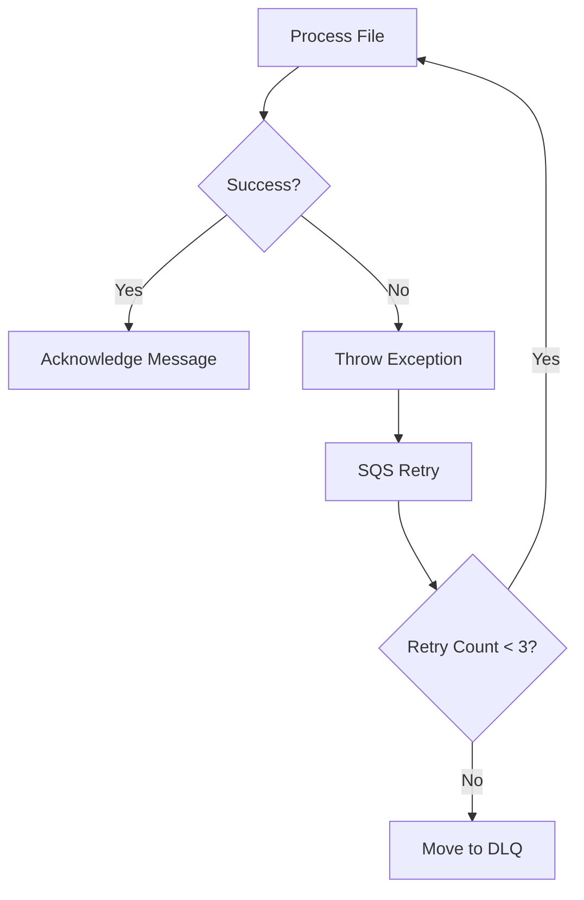

# Workflows

## Main Processing Flow



## Thumbnail Generation Flow



## Audit Log Lifecycle



## Error Handling



## Deployment Workflow

```bash
# 1. Build Lambda layers
./scripts/build_evtx_layer.sh
./scripts/build_pillow_layer.sh

# 2. Deploy infrastructure
cd infra
cdk deploy \
  -c audit_s3_access_point_alias=<audit-alias> \
  -c file_s3_access_point_alias=<file-alias> \
  -c output_s3_access_point_alias=<output-alias>
```
