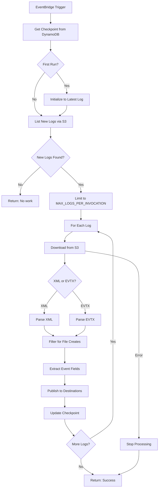
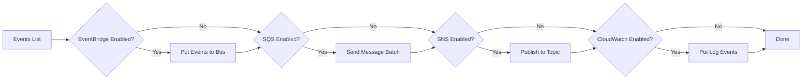
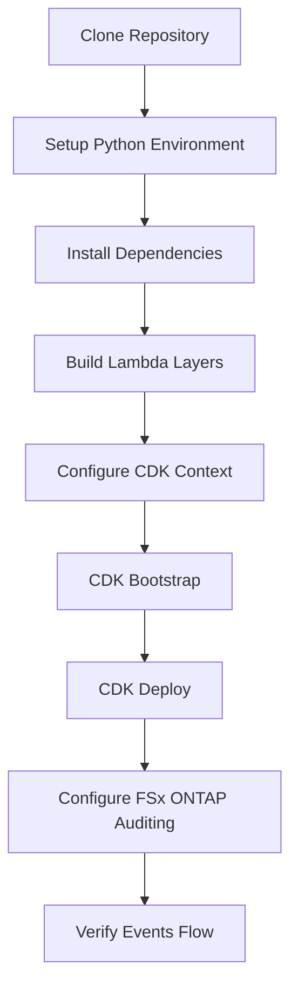
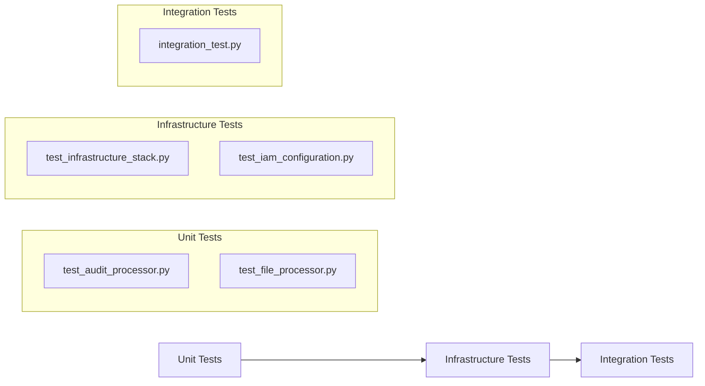
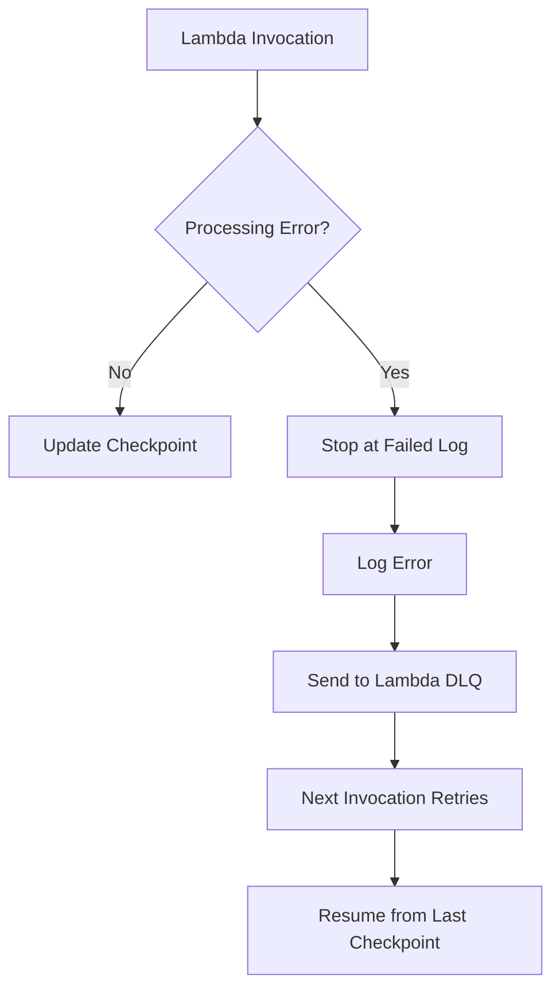

# Workflows

## Audit Log Processing Workflow



## Event Publishing Workflow



## Deployment Workflow



### Deployment Commands

```bash
# 1. Setup environment
cd audits
uv venv && source .venv/bin/activate
uv pip install -r requirements.txt

# 2. Build layers (if needed)
cd scripts
./build_evtx_layer.sh
./build_pillow_layer.sh

# 3. Deploy infrastructure
cd ../infra
cdk bootstrap  # First time only
cdk deploy \
  -c audit_s3_access_point_alias=<alias> \
  -c audit_s3_access_point_name=<name> \
  -c file_s3_access_point_alias=<alias> \
  -c file_s3_access_point_name=<name>
```

## Testing Workflow



### Test Commands

```bash
# Run all tests
pytest tests/

# Run specific test file
pytest tests/test_audit_processor.py -v

# Run with coverage
pytest tests/ --cov=lambda --cov-report=html
```

## Error Recovery Workflow



Key recovery behaviors:
1. **Per-log checkpointing**: Only successfully processed logs update checkpoint
2. **Stop on failure**: Prevents gaps in event delivery
3. **Lambda DLQ**: Captures failed invocations for analysis
4. **Automatic retry**: Next scheduled invocation resumes from checkpoint
