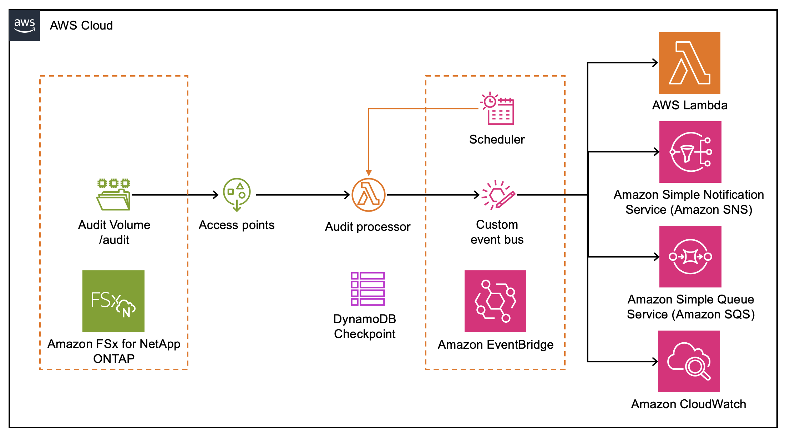

# FSx ONTAP Audit Event Processing

Event-driven serverless architecture for processing FSx ONTAP file operations using audit logs.

## Overview

This project implements an event-driven architecture for detecting file operations on FSx ONTAP file systems accessed via NFS/SMB protocols. Since NFS/SMB operations don't trigger S3 Event Notifications, the solution uses ONTAP's native audit logging capability combined with serverless AWS components.

**Key Features:**

- ✅ Detects file creation events from ONTAP audit logs (XML/EVTX formats)
- ✅ Publishes events to EventBridge for flexible routing
- ✅ Checkpoint-based processing for efficiency (99% reduction in S3 API calls)
- ✅ Configurable event routing (EventBridge, SQS, SNS, CloudWatch Logs)
- ✅ No data movement - files remain on FSx ONTAP
- ✅ ~2 minute latency from file creation to event delivery (with 1-min log rotation)

## Architecture



### Components

- **EventBridge (Schedule)**: Triggers audit processor every minute
- **Lambda (Audit Processor)**: Parses audit logs, publishes file events to EventBridge
- **DynamoDB**: Checkpoint tracking for processed audit logs
- **EventBridge (Custom Bus)**: Central event bus for file events with flexible routing
- **S3 Access Points**: Unified access for reading audit logs

## Project Structure

```
audits/
├── infra/                    # CDK infrastructure (deploy from here)
│   ├── app.py               # CDK app entry point
│   ├── fsx_audit_stack.py   # Stack definition
│   └── cdk.json             # CDK configuration
├── lambda/                   # Lambda function code
│   ├── audit_processor/     # Parses audit logs → EventBridge
│   │   └── index.py
│   └── file_processor/      # Example consumer (see Examples section)
│       └── index.py
├── layers/                   # Lambda layers
│   ├── evtx/                # python-evtx layer
│   └── pillow/              # Pillow layer (for examples)
├── scripts/                  # Build scripts
│   ├── build_evtx_layer.sh
│   ├── build_pillow_layer.sh
│   └── activate.sh
└── tests/                    # Unit & integration tests
```

## Requirements

### AWS Resources

- **Amazon FSx for NetApp ONTAP file system** - Active file system with at least one Storage Virtual Machine (SVM)
- **S3 Access Point** - Created for the audit volume where ONTAP writes audit logs
- **AWS Account** - With permissions to create Lambda functions, DynamoDB tables, EventBridge resources, and IAM roles

### Software Prerequisites

- **Node.js 14.x+** - Required for AWS CDK CLI
- **AWS CDK CLI** - For infrastructure deployment
- **Python 3.12+** - Required for Lambda runtime and local development
- **uv** - Python package manager for dependency management

### Optional (for Examples)

- **Additional S3 Access Points** - For file processing examples (data and output volumes)
- **Linux EC2 Instance** - For NFS auditing configuration (with nfs4-acl-tools installed)

## Quick Start

### 1. Install Tools

```bash
curl -LsSf https://astral.sh/uv/install.sh | sh
npm install -g aws-cdk
```

### 2. Setup Project

```bash
git clone https://github.com/aws-samples/sample-fsx-ontap-audit-events.git
cd sample-fsx-ontap-audit-events
uv venv
source .venv/bin/activate
uv pip install -r requirements.txt
./scripts/build_evtx_layer.sh
```

### 3. Deploy

```bash
cd infra
cdk deploy -c audit_s3_access_point_alias=audit-ap-xxxxx-s3alias
```

### Optional: Event Routing Configuration

Route audit events to different destinations based on SVM name and junction path:

```bash
# Create routing config file
cat > routes.json << 'EOF'
{
  "routes": [
    {"svm_name": "svm1", "junction_path": "unix", "destination_type": "sqs"},
    {"svm_name": "svm2", "junction_path": "ntfs", "destination_type": "sns", "destination_arn": "arn:aws:sns:us-east-1:111122223333:my-topic"},
    {"svm_name": "svm3", "junction_path": "data", "destination_type": "cloudwatch_logs"}
  ]
}
EOF

# Deploy with routing
cdk deploy \
  -c audit_s3_access_point_alias=audit-ap-xxxxx-s3alias \
  -c routing_config_path=./routes.json
```

**Routing Options:**
- `destination_type`: `sqs`, `sns`, `cloudwatch_logs`, or `eventbridge`
- `destination_arn`: Optional - CDK creates resource if not provided
- Events not matching any route go to the default EventBridge bus

## ONTAP Audit Configuration

SSH to FSx ONTAP management endpoint and configure auditing:

### Basic Audit Configuration

```bash
# Create a volume to store audit logs
volume create -volume audit -vserver <svm-name> -aggregate aggr1 \
  -size 10G -state online -security-style mixed -junction-path /audit

# Create audit configuration with 1-minute rotation
vserver audit create -vserver <svm-name> \
  -destination /audit \
  -format evtx \
  -rotate-schedule-minute 0-59

# Enable audit logging
vserver audit enable -vserver <svm-name>

# Verify configuration
vserver audit show -vserver <svm-name>
```

**Configuration Options:**

- **Format**: `xml` or `evtx` (both supported)
- **Rotation**: Every minute for lowest latency
- **Guarantee**: `true` for synchronous logging (enabled by default)

### NTFS Access Auditing (SMB)

To audit file access events on NTFS volumes, configure System Audit Control Lists (SACLs):

```bash
# 1. Create a volume with NTFS security style
volume create -volume ntfs -aggregate aggr1 -size 10G \
  -security-style ntfs -type RW -junction-path /ntfs -vserver <svm-name>

# 2. Create a share for the volume
cifs share create -share-name ntfs -path /ntfs \
  -share-properties oplocks,browsable,show-previous-versions -vserver <svm-name>

# 3. Create an NTFS security descriptor (requires advanced privileges)
set -privilege advanced
vserver security file-directory ntfs create -ntfs-sd sd1 \
  -vserver <svm-name> -owner DOMAIN\Admin

# 4. Add NTFS SACL access control entries for success and failure
vserver security file-directory ntfs sacl add -vserver <svm-name> \
  -ntfs-sd sd1 -access-type failure -account Everyone -rights full-control

vserver security file-directory ntfs sacl add -vserver <svm-name> \
  -ntfs-sd sd1 -access-type success -account Everyone -rights full-control

# 5. Create an audit policy
vserver security file-directory policy create -policy-name policy1 -vserver <svm-name>

# 6. Add a task to the security policy
vserver security file-directory policy task add -vserver <svm-name> \
  -policy-name policy1 -path /ntfs -security-type ntfs -ntfs-mode propagate \
  -ntfs-sd sd1 -index-num 1 -access-control file-directory

# 7. Apply the security policy
vserver security file-directory apply -vserver <svm-name> -policy-name policy1
```

### UNIX Access Auditing (NFS)

To audit file access events on UNIX volumes, configure NFSv4 ACLs with audit flags:

```bash
# 1. Enable NFSv4 ACL support
vserver nfs modify -vserver <svm-name> -v4.0 enabled \
  -v4.0-acl enabled -v4.1-acl enabled

# 2. Create a volume with UNIX security style
volume create -volume unix -aggregate aggr1 -size 10G \
  -security-style unix -type RW -junction-path /unix -vserver <svm-name>

# 3. Mount the volume on a Linux client
mkdir /mnt/unix
sudo mount -t nfs <svm-nas-endpoint>:/unix /mnt/unix

# 4. Recursively add auditing flags to the directory
nfs4_setfacl -R -a U:fdS:EVERYONE@:Cd /mnt/unix
```

**Audit Flags:**
- `f` - Audit failed access attempts
- `d` - Audit successful access attempts
- `S` - Audit successful access (alternative)
- `F` - Audit failed access (alternative)

**Note**: For both NTFS and UNIX auditing, ensure the audit configuration is enabled (see Basic Audit Configuration above).

## Environment Variables

### Audit Processor Lambda

| Variable | Description |
|----------|-------------|
| `BUCKET` | S3 Access Point alias for audit logs |
| `AUDIT_PREFIX` | Path prefix for audit logs (default: empty) |
| `TABLE_NAME` | DynamoDB table name for checkpoint |
| `EVENT_BUS_NAME` | EventBridge bus name for file events |
| `EVENT_TYPES_CONFIG` | JSON config for event types to monitor (see below) |
| `ROUTING_CONFIG` | JSON routing config (optional) |
| `MAX_KEYS` | Maximum logs to process per run (default: 100) |
| `MAX_LOGS_PER_INVOCATION` | Maximum logs to process per invocation (default: 10) |

### Event Types Configuration

Control which file operations trigger events:

| Event Type | Description | Volume | Default |
|------------|-------------|--------|---------|
| `create` | File creation | Low | ✅ Enabled |
| `delete` | File deletion | Low | ✅ Enabled |
| `modify` | File writes/updates | High | ❌ Disabled |
| `read` | File reads | Very High | ❌ Disabled |
| `rename` | File renames | Moderate | ❌ Disabled |

**Default configuration** (create + delete only):
```json
{
  "create": true,
  "delete": true,
  "modify": false,
  "read": false,
  "rename": false
}
```

**Enable modify events**:
```bash
cdk deploy \
  -c audit_s3_access_point_alias=audit-ap-xxxxx-s3alias \
  -c event_types='{"create":true,"delete":true,"modify":true}'
```

**⚠️ Volume Warning**: Enabling `modify` or `read` events can generate 10-100x more events. Start with `create` + `delete` and monitor costs before enabling high-volume events.

### Event Volume Estimates

Typical estimates (test with your workload):

| Configuration | Events/Hour | Lambda Cost/Month | EventBridge Cost/Month |
|---------------|-------------|-------------------|------------------------|
| Create only | 100 | $0.50 | $0.05 |
| Create + Delete | 200 | $0.75 | $0.10 |
| + Modify | 5,000 | $5-10 | $5 |
| + Read | 50,000 | $50-100 | $50 |

## Testing

### Unit Tests

```bash
source .venv/bin/activate
uv pip install -r requirements-dev.txt
pytest tests/ -v
```

### Integration Test

```bash
python tests/integration_test.py \
  --audit-alias <audit-ap-alias> \
  --file-alias <file-ap-alias> \
  --region eu-west-1
```

## CDK Commands

Run from the `infra/` directory:

```bash
# Synthesize CloudFormation template
cdk synth

# Show differences
cdk diff

# Deploy stack
cdk deploy

# Destroy stack
cdk destroy
```

## Monitoring

### CloudWatch Logs

- **Audit Processor**: `/aws/lambda/FsxAuditStack-AuditLogProcessor-*`

### Debugging Commands

```bash
# View Lambda logs
aws logs tail /aws/lambda/FsxAuditStack-AuditLogProcessor-* --follow

# Check DynamoDB checkpoint
aws dynamodb get-item \
  --table-name <table-name> \
  --key '{"pk": {"S": "tracker"}}'
```

### Verifying EventBridge Events

To confirm events are being delivered to EventBridge, create a temporary catch-all rule that sends events to CloudWatch Logs:

```bash
# 1. Create a log group for debug events
aws logs create-log-group \
  --log-group-name /aws/events/fsx-audit-debug \
  --region <region>

# 2. Allow EventBridge to write to CloudWatch Logs
aws logs put-resource-policy \
  --policy-name EventBridgeToCloudWatch \
  --policy-document '{
    "Version": "2012-10-17",
    "Statement": [{
      "Sid": "EventBridgeToLogs",
      "Effect": "Allow",
      "Principal": {"Service": "events.amazonaws.com"},
      "Action": ["logs:CreateLogStream", "logs:PutLogEvents"],
      "Resource": "arn:aws:logs:<region>:<account-id>:log-group:/aws/events/*"
    }]
  }' \
  --region <region>

# 3. Create a rule matching all audit events
aws events put-rule \
  --name debug-catch-all \
  --event-bus-name FsxAuditStack-file-events \
  --event-pattern '{"source":["fsx.ontap.audit"]}' \
  --region <region>

# 4. Add CloudWatch Logs as the target
aws events put-targets \
  --rule debug-catch-all \
  --event-bus-name FsxAuditStack-file-events \
  --targets '[{"Id":"debug-logs","Arn":"arn:aws:logs:<region>:<account-id>:log-group:/aws/events/fsx-audit-debug"}]' \
  --region <region>

# 5. Tail the log group to see events arriving
aws logs tail /aws/events/fsx-audit-debug --follow --region <region>
```

Clean up when done:

```bash
aws events remove-targets --rule debug-catch-all --event-bus-name FsxAuditStack-file-events --ids debug-logs --region <region>
aws events delete-rule --name debug-catch-all --event-bus-name FsxAuditStack-file-events --region <region>
aws logs delete-log-group --log-group-name /aws/events/fsx-audit-debug --region <region>
```

## Troubleshooting

### No logs being processed

- Check ONTAP audit is enabled: `vserver audit show`
- Verify audit logs are being written to FSx volume
- Check Lambda has S3 permissions
- Verify DynamoDB checkpoint is not stuck

### No delete events appearing

1. **Verify delete events are enabled**:
   ```bash
   aws lambda get-function-configuration \
     --function-name FsxAuditStack-AuditLogProcessor-* \
     --query 'Environment.Variables.EVENT_TYPES_CONFIG'
   ```
   Should show `"delete":true`

2. **Check Lambda logs for Event ID 4660** (delete events):
   ```bash
   aws logs filter-pattern /aws/lambda/FsxAuditStack-AuditLogProcessor-* \
     --filter-pattern "4660"
   ```

### Too many events (high volume)

1. **Disable high-volume event types**:
   ```bash
   cdk deploy \
     -c audit_s3_access_point_alias=audit-ap-xxxxx-s3alias \
     -c event_types='{"create":true,"delete":true,"modify":false,"read":false}'
   ```

2. **Add EventBridge filtering** to route only specific paths or operations

3. **Reduce MAX_LOGS_PER_INVOCATION** if Lambda times out

## Key Design Decisions

1. **First-run initialization**: On first deployment, skips to latest audit log to avoid processing historical backlog

2. **Active log detection**: Skips `*_last.xml` and `*_last.evtx` files that are currently being written

3. **Checkpoint-based processing**: Uses S3 `StartAfter` for efficient listing without re-scanning

## Examples

### Example 1: Thumbnail Generation

This project includes an example Lambda function that automatically generates thumbnails for images uploaded to FSx ONTAP.

**Architecture:**

```
                 ┌──────────────┐
                 │  EventBridge │
                 │  Custom Bus  │
                 └──────┬───────┘
                        │
                        ▼
                ┌───────────────┐
                │ EventBridge   │
                │ Rule (Images) │
                └───────┬───────┘
                        │
                        ▼
                  ┌─────────┐
                  │   SQS   │
                  │  Queue  │
                  └────┬────┘
                       │
                       ▼
            ┌──────────────────────┐
            │ Lambda File Processor │
            │  - Read image         │
            │  - Generate thumbnail │
            └──────────┬────────────┘
                       │
                       ▼
              ┌────────────────┐
              │   FSx ONTAP    │
              │ (Output Volume)│
              └────────────────┘
```

**Setup:**

1. Build the Pillow layer:
   ```bash
   ./scripts/build_pillow_layer.sh
   ```

2. Deploy with file processor enabled:
   ```bash
   cd infra
   cdk deploy \
     -c audit_s3_access_point_alias=audit-ap-xxxxx-s3alias \
     -c file_s3_access_point_alias=data-ap-xxxxx-s3alias \
     -c output_s3_access_point_alias=output-ap-xxxxx-s3alias
   ```

**How it works:**

1. File creation events are published to EventBridge
2. EventBridge rule filters for image files and sends to SQS queue
3. Lambda function reads the image from FSx ONTAP via S3 Access Point
4. Generates a 200x200 thumbnail using Pillow
5. Writes thumbnail to output volume with `_thumb` suffix

**Supported formats:** JPEG, PNG, GIF, WebP, TIFF, BMP

**Environment Variables:**

| Variable | Description |
|----------|-------------|
| `S3_ACCESS_POINT_ALIAS` | S3 Access Point alias for reading source files |
| `OUTPUT_S3_ACCESS_POINT_ALIAS` | S3 Access Point alias for writing thumbnails |

**Monitoring:**

```bash
# View file processor logs
aws logs tail /aws/lambda/FsxAuditStack-FileProcessor-* --follow

# Check SQS queue depth
aws sqs get-queue-attributes \
  --queue-url <queue-url> \
  --attribute-names ApproximateNumberOfMessages
```

**Troubleshooting:**

- **Thumbnail not generated**: Check file is a supported image format, verify file exists in FSx volume
- **SQS messages in DLQ**: Check Lambda logs for processing errors, verify S3 Access Point is accessible
- **Feedback loop**: Use separate `output_s3_access_point_alias` pointing to a non-audited volume

**Code Location:** `lambda/file_processor/index.py`

## References

- [FSx ONTAP S3 Access Points](https://docs.aws.amazon.com/fsx/latest/ONTAPGuide/accessing-data-via-s3-access-points.html)
- [ONTAP Audit Configuration](https://docs.aws.amazon.com/fsx/latest/ONTAPGuide/file-access-auditing.html)
- [AWS Lambda Best Practices](https://docs.aws.amazon.com/lambda/latest/dg/best-practices.html)

## Security

See [CONTRIBUTING](CONTRIBUTING.md#security-issue-notifications) for more information.

## License

This library is licensed under the MIT-0 License. See the LICENSE file.
